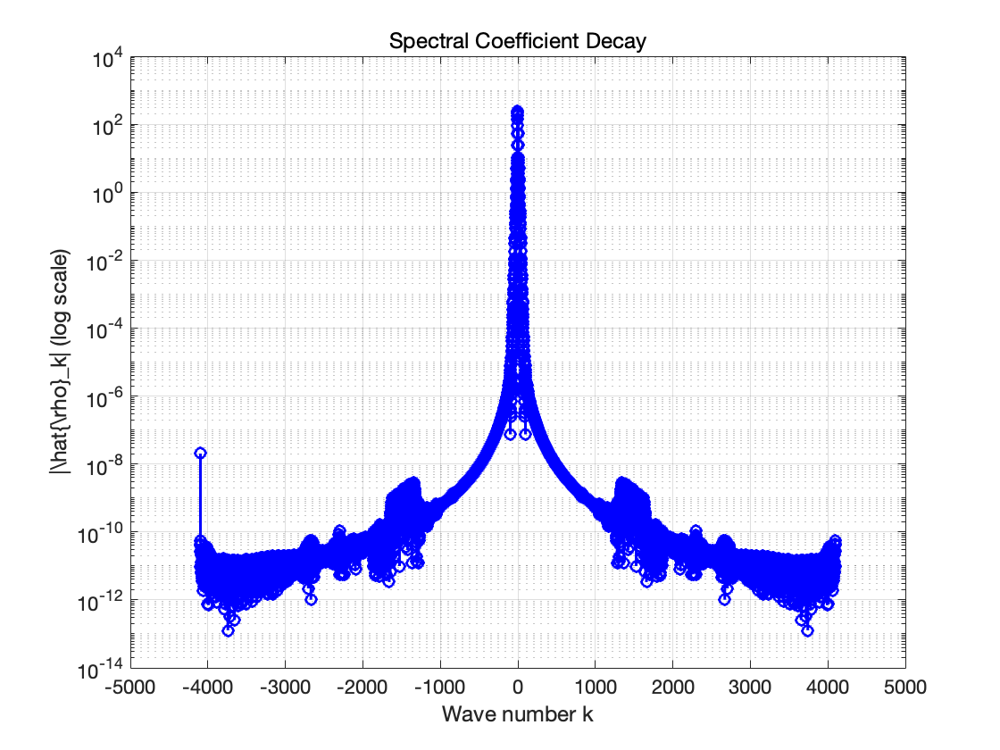

# SP_Opt-g-BEC-HOI
This is the joint work with Bo Lin

We aim to design a spectrally accurate method for computing ground states of BEC with higher order interactions. 

The idea is to apply density-based gradient flow / optimization technique, combining with a postive preserving spectrally accurate projection technique.

## Code-DensityFormulation

Optimization of Energy Functionals Based on Regularized Density Formulations

### Discrete energy functional
For 1D case, we consider the energy functional 
$$
	E(\rho) = \int_a^b \left[ \frac{|\nabla \rho|^2}{8(\rho+\varepsilon)} + V(x) \rho + \frac{\beta}{2}\rho^2 + \frac{\delta}{2}|\nabla\rho|^2\right]dx, x\in[a,b].
$$
Denote $$x_j=a+jh, j=0,1,...,N,$$ where $h=\frac{b-a}{N}$. The energy functional can be discretized as 
$$
	E_h(\rho) = h\sum_{j=0}^{N-1} \left[ \frac{|\delta_x^s \rho_j|^2}{8(\rho_j+\varepsilon)} + V(x_j) \rho_j + \frac{\beta}{2}\rho_j^2 + \frac{\delta}{2}|\delta_x^s \rho_j|^2\right],
$$
where $\rho_j=\rho(x_j)$, satisfying the periodic boundary condition, and $\delta_x^s \rho_j$ is the pseudospectral approximation of $\nabla \rho(x_j)$. 
We aim to find $\rho_g\in S_N^+$ such that 
$$
	\rho_g = {argmin}_{\rho \in S_N^+} E_h(\rho), 
$$
where the discrete function space $S_N^+$ is defined as  
$$
	S_N^+ := span\{\Phi_l(x) = e^{i\frac{2\pi l(x-a)}{b-a}}, l = 0,1,2,\cdots, N-1 \} \cap \{ f(x) : f(x_j) \ge 0, j = 0,1,2,\cdots, N-1 \}.
$$
Here we do not force $\rho_g(x)$ to be positive over $[a,b]$. Instead, we only require $\rho_g(x)$ to be positive on the grids. 

**Proposition**: $E_h(\rho)$ is convex in $S_N^+$.

**Proof**: It is sufficient to prove the convexity of 
$$
	E_{kin}(\rho) =  \frac{h}{8}\sum_{j=0}^{N-1} \frac{|\delta_x^s \rho_j|^2}{\rho_j+\varepsilon}.
$$
A direct computation shows that 
$$
\begin{aligned}
	\frac{E_{kin}(a) + E_{kin}(b)}{2} & =  \frac{h}{16}\sum_{j=0}^{N-1} \left[\frac{|\delta_x^s a_j|^2}{a_j+\varepsilon} + \frac{|\delta_x^s b_j|^2}{b_j+\varepsilon}\right]\\
	& = \frac{h}{16}\sum_{j=0}^{N-1} \frac{|\delta_x^s a_j|^2\left(1 + \frac{b_j+\varepsilon}{a_j+\varepsilon}\right) + |\delta_x^s b_j|^2\left(1 + \frac{a_j+\varepsilon}{b_j+\varepsilon}\right)}{a_j + b_j +2\varepsilon}\\
	& \ge \frac{h}{16}\sum_{j=0}^{N-1} \frac{|\delta_x^s a_j|^2 + 2(\delta_x^s a_j)(\delta_x^s b_j) + |\delta_x^s b_j|^2}{a_j + b_j +2\varepsilon}\\
	& = \frac{h}{16}\sum_{j=0}^{N-1} \frac{(\delta_x^s a_j + \delta_x^s b_j)^2}{a_j + b_j +2\varepsilon}\\
	& = \frac{h}{8}\sum_{j=0}^{N-1} \frac{\left(\delta_x^s \frac{a_j+b_j}{2} \right)^2}{\frac{a_j + b_j}{2} + \varepsilon}\\
	& = E_{kin}\left(\frac{a+b}{2}\right)
\end{aligned}
$$

### Details of the pseudospectral discretization
### FFT
For simplicity of notations, we use $\mu_l =\frac{2\pi l}{b-a}$. Since 
$$
	\rho(x) \approx \sum_{l=-\frac{N}{2}}^{\frac{N}{2}-1} \hat{\rho}_l e^{i\mu_l(x-a)}，
$$
the first derivatives at grid points can be computed as 
$$
	\frac{d \rho}{dx}(x) \approx \delta_x^s \rho := \sum_{l=-\frac{N}{2}}^{\frac{N}{2}-1} i\mu_l\hat{\rho}_l e^{i\mu_l(x-a)}.
$$
At grid points, 
$$
	\rho_j = \sum_{l=-\frac{N}{2}}^{\frac{N}{2}-1} \hat{\rho}_l e^{i\frac{2\pi l j}{N}}, 
	\quad 
	\delta_x^s \rho_j = \sum_{l=-\frac{N}{2}}^{\frac{N}{2}-1} i\mu_l\hat{\rho}_l e^{i \frac{2\pi l j}{N}}.
$$
Conversely,
$$
	\hat{\rho}_l = \frac{1}{N} \sum_{j=0}^{N-1} \rho_j e^{-i \frac{2\pi jl}{N}}.
$$
It is easy to see that 
$$
	\hat{\rho}_{l+N} = \hat{\rho}_{l}.
$$

**Proposition 1**：If $\rho\in\mathbb{R}^N$, then $\hat{\rho}_{N-k} = \overline{\hat{\rho}}_k$. （共轭对称性）

**Proof**: 
$$
	\hat{\rho}_{N-k} = \frac{1}{N} \sum_{j=0}^{N-1} \rho_j e^{-i \frac{2\pi j(N-k)}{N}} = \frac{1}{N} \sum_{j=0}^{N-1} \rho_j e^{i \frac{2\pi jk}{N}} = \overline{\hat{\rho}}_k.
$$

**Corollary 1**: $\hat{\rho}_{-\frac{N}{2}} = \hat{\rho}_{\frac{N}{2}} \in \mathbb{R}$.

**Proposition 2**: $Re(\delta_x^s \rho_j) = \sum_{l=-\frac{N}{2}+1}^{\frac{N}{2}-1} i\mu_l\hat{\rho}_l e^{i \frac{2\pi l j}{N}}$, $Im(\delta_x^s \rho_j) = i\mu_{-\frac{N}{2}}\hat{\rho}_{-\frac{N}{2}} e^{-i \pi j} = i\mu_{-\frac{N}{2}}\hat{\rho}_{-\frac{N}{2}}(-1)^j$

**proof**: For $k = -\frac{N}{2}$, $i\mu_{-\frac{N}{2}}\hat{\rho}_{-\frac{N}{2}} e^{-i \pi j} = i\mu_{-\frac{N}{2}}\hat{\rho}_{-\frac{N}{2}}(-1)^j$ is a pure imaginary number.
For $k\neq -\frac{N}{2}$, 
$$
	i\mu_k \hat{\rho}_k e^{i \frac{2\pi k j}{N}} + i\mu_{-k} \hat{\rho}_{-k} e^{i \frac{-2\pi k j}{N}} = i\mu_k (\hat{\rho}_k e^{i \frac{2\pi k j}{N}} - \overline{\hat{\rho}_{k} e^{i \frac{2\pi k j}{N}}}) \in \mathbb{R},
$$
where the periodicity and Proposition 1 are applied. Therefore, $ \sum_{l=-\frac{N}{2}+1}^{\frac{N}{2}-1} i\mu_l\hat{\rho}_l e^{i \frac{2\pi l j}{N}} \in \mathbb{R}$. 

**As a remark, in practice we only need to take the real part for computing $\delta_x^s \rho_j$.**

#### Relations via Matrices
The above relations can be described by using matrices. Define the diagonal matrix $\Lambda= \text{diag}\{i\mu_0, i\mu_1, \cdots, i\mu_{\frac{N}{2}-1}, i\mu_{-\frac{N}{2}}, i\mu_{-\frac{N}{2}+1}, \cdots, i\mu_{-1}\}$ and the symmetric matrix $F=(F_{j,k})\in\mathbb{R}^{N\times N}$, where 
$$
	F_{j,k} = e^{i\frac{2\pi jk}{N}},
$$
and define the vectors $\rho = (\rho_0, \rho_1, \cdots, \rho_{N-1})^T$ and $\hat{\rho} = (\hat{\rho}_0, \hat{\rho}_1, \cdots, \hat{\rho}_{N-1})^T$, then

| Relation | Matlab Code |
| ------- | ---------  |
|$\rho = F \hat{\rho}$| `rho = N * ifft(Frho)`|
|$\hat{\rho} = F^{-1} \rho = \frac{1}{N} \overline{F} \rho$ | `Frho = 1 / N * fft(rho)`|
|$\delta_x^s \rho = D\rho$ | `drho = fourier_diff(rho, Lambda);`|
| $D^T\rho$ | `drho_T = fourier_diff_T(rho, Lambda);`|

where $D = \mathcal{R}(\frac{1}{N} F \Lambda\overline{F}), D^T = \mathcal{R}(\frac{1}{N} \overline{F} \Lambda F)$ and 

```Matlab
function [drho] = fourier_diff(rho, Lambda)
    Frho = fft(rho);
    Fdrho = Lambda .* Frho;
    drho = real(ifft(Fdrho));
end
```

```Matlab
function [drho_T] = fourier_diff_T(rho, Lambda)
    iFrho = ifft(rho);
    iFdrho = Lambda .* iFrho;
    drho_T = real(fft(iFdrho));
end
```

### Gradient of the discrete energy functional 
Vectorization of the energy functional: 
$$
	E_h(\rho) = h\sum_{j=0}^{N-1} 
	\left[
	\frac{(D\rho)_j^2}{8(\rho_j+\varepsilon)} + V_j\rho_j +\frac{\beta}{2}\rho_j^2 + \frac{\delta}{2} (D\rho)_j^2,
	\right]
$$
where $D = \mathcal{R}(\frac{1}{N} F \Lambda\overline{F})$. A detailed computation shows the partial derivative of each $\rho_i$ as follows
$$
	\frac{\partial}{\partial \rho_i} \frac{(D\rho)_j^2}{8(\rho_j+\varepsilon)} 
	=
	\frac{(D\rho)_j D_{ji}}{4(\rho_j+\varepsilon)}
	-\frac{(D\rho)_j^2}{8(\rho_j+\varepsilon)^2}\delta_{ij}
$$
$$
	\frac{\partial}{\partial \rho_i}(V_j\rho_j) = V_j \delta_{ij}
$$
$$
	\frac{\partial}{\partial \rho_i}\left(\frac{\beta}{2}\rho_j^2\right) = \beta \rho_j \delta_{ij}
$$
$$
	\frac{\partial}{\partial \rho_i}\left(\frac{\delta}{2}(D\rho)_j^2\right) = \delta (D\rho)_j D_{ji}.
$$
To summarize 

| Energy | Gradient | Matlab Code |
| ------- | ------- | ---------  |
|$h\sum_{j=0}^{N-1} \frac{(D\rho)_j^2}{8(\rho_j+\varepsilon)}$| $h \left[ D^T\frac{D\rho}{4(\rho+\varepsilon)} - \frac{(D\rho)^2}{8(\rho+\varepsilon)^2}\right]$ | `Drho = fourier_diff(rho, Lambda);`  `Grho = Drho ./ (rho + vep);`  `DtGrho = fourier_diff_T(Grho, Lambda);`    `dE_kin = h * (DtGrho / 4 - Grho.^2 / 8);` |
|$h\sum_{j=0}^{N-1} V_j\rho_j$ | $hV$ | `dE_pot = h * V;`|
|$h\sum_{j=0}^{N-1} \frac{\beta}{2}\rho_j^2$ | $h\beta \rho$ | `dE_beta = h * beta * rho` |
|$h\sum_{j=0}^{N-1} \frac{\delta}{2} (D\rho)_j^2$ | $h\delta D^T D\rho$ | `Drho = fourier_diff(rho, Lambda);`    `DtDrho = fourier_diff_T(Drho, Lambda);`   `dE_delta = h * delta * DtDrho;` |

**Proposition**: $\nabla E(\rho)$ is Lipschitz continuous in $\rho$, i.e. 
$$
	\|\nabla E(x) - \nabla E(y)\| \le L \|x-y\|.
$$
**Proof**: We only need to show the Lipschitz continuity of the kinetic energy term. 
$$
\begin{aligned}
	\| D^T\frac{D x}{4(x+\varepsilon)} - D^T\frac{D y}{4(y+\varepsilon)} \| & \le \frac{\|D\|}{4} \left\|  \frac{D x}{x+\varepsilon} - \frac{D y}{y+\varepsilon} \right\| \\
	& \le \frac{\|D\|}{4} \left(\left\|\frac{Dx - Dy}{x+\varepsilon}\right\| + \left\|Dy \frac{y-x}{(x+\varepsilon)(y+\varepsilon)}\right\|\right)\\
	& \le \frac{\|D\|}{4} \left(\frac{\|D\|}{\varepsilon}\|y-x\| + \frac{\|Dy\|_\infty}{\varepsilon^2} \|y-x\|\right)\\
	& \le \frac{\|D\|}{4} \left(\frac{\|D\|}{\varepsilon} + \frac{\|D\|_\infty \|y\|_\infty}{\varepsilon^2} \right)\|y-x\|\\
	& \le \frac{\|D\|}{4} \left(\frac{\|D\|}{\varepsilon} + \frac{\|D\|_\infty}{h\varepsilon^2} \right)\|y-x\|
\end{aligned}
$$
where $\|D\|_\infty = max_j \sum_{k=1}^N |D_{jk}|$.

### DST
We use $\nu_l =\frac{\pi l}{b-a}$. Since 
$$
	\rho(x) \approx \sum_{l=1}^{N-1} \hat{\rho}_l \sin(\nu_l(x-a))，
$$
the first derivatives at grid points can be computed as 
$$
	\frac{d \rho}{dx}(x) \approx \sum_{l=1}^{N-1} \nu_l\hat{\rho}_l \cos(\nu_l(x-a)).
$$
At grid points, 
$$
	\rho_j = \sum_{l=1}^{N-1} \hat{\rho}_l \sin\left(\frac{\pi l j}{N}\right), 
	\quad 
	\delta_x^s \rho_j = \sum_{l=1}^{N-1} \nu_l\hat{\rho}_l \cos\left(\frac{\pi l j}{N}\right).
$$
Conversely, using the orthogonality relation
$$
	\sum_{j=1}^{N-1} \sin\left(\frac{\pi l j}{N}\right) \sin\left(\frac{\pi m j}{N}\right) 
$$
$$
	\hat{\rho}_l = .
$$

#### Relation with FFT
The coefficients and the first derivative can be computed via an odd extension.

`X_OddExt = [0; -X(end:-1:1); 0; X];`

| FFT ($M=2N$) | DST |
|-----------|-----------|
| $\rho_j = \sum_{l=-\frac{M}{2}}^{\frac{M}{2}-1} \hat{\rho}_l e^{i\frac{2\pi l j}{N}} =  \sum_{l=-N}^{N-1} \hat{\rho}_l \left[\cos\left(\frac{\pi l j}{N}\right) + i \sin\left(\frac{\pi l j}{N}\right)\right]$ |$\rho_j = \sum_{l=1}^{N-1} \hat{\rho}_l^{(s)} \sin\left(\frac{\pi l j}{N}\right)$|

Obviously, $\hat{\rho}_0 = \hat{\rho}_{-N} = 0$, $Re(\hat{\rho}_{l})=0$, which together with $\hat{\rho}_{l} = \overline{\hat{\rho}}_{-l}$ immediately implies that $\hat{\rho}_{-l} = -\hat{\rho}_{l}$.  
$$
	\rho_l^{(s)} = -2 Im(\hat{\rho}_{l}).
$$

注：奇延拓（odd extension）虽然能实现快速正弦变换，但确实可能导致精度下降，尤其是在处理导数时。在拼接点处可能只有C_0连续。

## ISTA/FISTA
Key functions used in the algorithm:

*  $Q_L(x, y)$: Quadratic approximation of $f(x)$ defined as (linear approximation with quadratic penalty)
$$
	Q_L(x, y) := f(y) + \langle x - y, \nabla f(y)\rangle  + \frac{L}{2}\|x-y\|^2.
$$

*  $p_L(y)$: Unique minimizer of $Q_L(x,y)$ in the feasible set $S_N^+(1)$, where $S_N^+(1) = S_N^+ \cap \{X\in\mathbb{R}^N \, | \,  h \sum_{i=1}^N X(i)= 1\}$. 
Simple algebra shows that 
$$
	p_L(y) = argmin_{x\in S_N^+(1)} \left\|x - \left(y - \frac{1}{L} \nabla f(y)\right)\right\|.
$$

Remark: Sometimes we use the "prox"(近端投影算子) 
$$
	p_L(y) = Prox_{\gamma g}(y - \gamma\nabla f(y)) = argmin_x \left\{g(x) + \frac{1}{2\gamma}\|x - \left(y - \gamma\nabla f(y)\right)\|^2\right\}
$$
When $g(x) = 1_{S_N^+(1)}(x)$, the above definition is equivalent. 

**Algorithm 1.1**: ISTA with constant stepsize
Step k: 
$$
	X_k = p_L(X_{k-1})
$$
Here $L$ can be taken as $L(f)$, a Lipschitz constant of $\nabla f$.

**Algorithm 1.2**: ISTA with backtracking
$$
	L_0 > 0, \, \eta > 1
$$
Step k: 
Find smallest $i_k$ such that with $\overline{L} = \eta^{i_k} L_{k-1}$, 
$$
	f(p_{\overline{L}}(X_{k-1})) \le Q_{\overline{L}}(p_{\overline{L}}(X_{k-1}), X_{k-1}).
$$
Set $L_k = \overline{L}$ and compute
$$
	X_k = p_{L_k}(X_{k-1}).
$$

**Algorithm 2.1**: FISTA with constant stepsize
$$
	Y_1 = X_0, \, t_1 = 1
$$
Step k: 
$$
\begin{aligned}
	&X_k = p_L(Y_k)\\
	&t_{k+1} = \frac{1+\sqrt{1+4t_k^2}}{2}\\
	&Y_{k+1} = X_k + \left(\frac{t_k-1}{t_{k+1}}\right)(X_k - X_{k-1})
\end{aligned}
$$

**Algorithm 2.2**: FISTA with backtracking
$$
	L_0 > 0, \, \eta > 1, \, y_1 = x_0, \, t_1 = 1
$$
Step k: 
Find smallest $i_k$ such that with $\overline{L} = \eta^{i_k} L_{k-1}$, 
$$
	f(p_{\overline{L}}(Y_{k})) \le Q_{\overline{L}}(p_{\overline{L}}(Y_{k}), Y_{k}).
$$
Set $L_k = \overline{L}$ and compute
$$
\begin{aligned}
	&x_k = p_L(y_k)\\
	&t_{k+1} = \frac{1+\sqrt{1+4t_k^2}}{2}\\
	&y_{k+1} = x_k + \left(\frac{t_k-1}{t_{k+1}}\right)(x_k - x_{k-1})
\end{aligned}
$$

### Convergence analysis
#### Preparation
**Proposition 1**:If $f$ is convex and $\|\nabla f(x) - \nabla f(y) \| \le L_0 \|x - y\|$, then 
$$
\begin{aligned}
	& f(x) \ge f(y) + \langle x - y, \nabla f(y)\rangle  \\
	& f(x) \le f(y) + \langle x - y, \nabla f(y)\rangle  + \frac{L_0}{2}\|x-y\|^2 = Q(x, y).
\end{aligned}
$$
**Proof**: We only show the second inequality here.
$$
\begin{aligned}
	f(x) - f(y) - \langle x - y, \nabla f(y)\rangle  &= \int_0^1 \langle \nabla f(y+t(x-y)) - \nabla f(y), x-y\rangle  dt \\
	& \le L_0 \int_0^1 t \|x-y\|^2 dt \\
	& = \frac{L_0}{2} \|x-y\|^2.
\end{aligned}
$$

The following proposition is important to prove convergence. A proof of the proposition will depend on the following lemma.
**Lemma**: If $x^*$ is a local minimizer of $f(x)$ in $\Omega$, then we must have
$$
	-\nabla f \in N_\Omega(x^*),
$$
where $N_\Omega(x^*)$ is the normal cone defined as 
$$
	N_\Omega(x) = \{ v \, | \, v^Tw \le 0, \forall w \in T_\Omega(x) \}.
$$
Here $T_\Omega(x)$ is the tangent cone, the set of all tangents at $x$. We say $d$ is a tangent at $x$ if there exist $\{z_k\}\to x$ and $\{t_k\}\to0$ such that 
$\lim_{k\to\infty} \frac{z_k-x}{t_k} = d$. 

**Proposition 2**: For any $x \in \mathbb{R}^N,y \in S_N^+(1)$, if 
$$
	f(p_L(y)) \le Q(p_L(y), y) = f(y) + \langle p_L(y) - y, \nabla f(y)\rangle  + \frac{L}{2}\|p_L(y)-y\|^2,
$$
then 
$$
	F(x) - F(p_L(y)) \ge \frac{L}{2} \|p_L(y)-y\|^2 + L\langle y-x, p_L(y)-y\rangle , 
$$
where $F(x) := f(x) + \mathbb{I}_{S_N^+(1)}(x)$.
**Proof**: If $x\notin S_N^+(1)$, then $F(x)=+\infty$ and the inequality is trivial. 
If $x\in S_N^+(1)$, noticing the definition of $p_L(y)$, we must have via the lemma that
$$
	p_L(y) - \left(y-\frac{1}{L} \nabla f(y)\right) \in N_{S_N^+(1)}(p_L(y)).
$$
Define 
$$
	\gamma = -\nabla f(y) + L(y - p_L(y)),
$$
then 
$$
	\langle \gamma, w\rangle  \le 0, \, \forall w\in T_{S_N^+(1)}(p_L(y)).
$$
It is easy to check that for all $x\in S_N^+(1)$, $x-p_L(y) \in T_{S_N^+(1)}(p_L(y))$, which implies 
$$
	\langle x-p_L(y), \gamma\rangle  \le 0.
$$
Then 
$$
\begin{aligned}
	f(x) - f(p_L(y)) & \ge f(x) - Q(p_L(y),y) \\ 
	& = f(x) - f(y) - \langle p_L(y) - y, \nabla f(y)\rangle  - \frac{L}{2}\|p_L(y)-y\|^2 \\
	& \ge \langle x - p_L(y), \nabla f(y)\rangle  - \frac{L}{2}\|p_L(y)-y\|^2 \text{ (by convexity of } f) \\ 
	&\ge \langle x - p_L(y), \nabla f(y)\rangle  - \frac{L}{2}\|p_L(y)-y\|^2 + \langle x-p_L(y), \gamma\rangle  \\
	& = \langle x - p_L(y), \nabla f(y) + \gamma\rangle  - \frac{L}{2}\|p_L(y)-y\|^2  \\
	& = L\langle x - p_L(y), y - p_L(y)\rangle  - \frac{L}{2}\|p_L(y)-y\|^2 \\
	& = L\langle x - y, y - p_L(y)\rangle  + \frac{L}{2}\|p_L(y)-y\|^2 \\
	& = L\langle y - x, p_L(y) - y\rangle  + \frac{L}{2}\|p_L(y)-y\|^2
\end{aligned}
$$

**Remark**: If $y - \frac{1}{L} \nabla f(y) \in S_N^+(1)$, a simpler proof goes as follows, noticing that  
$$
	p_L(y) = y - \frac{1}{L} \nabla f(y)
$$
and therefore
$$
	\nabla f(y) = L(y - p_L(y)).
$$
By substitution, we get
$$
\begin{aligned}
	f(x) - f(p_L(y)) &\ge L\langle x - p_L(y), y - p_L(y)\rangle- \frac{L}{2}\|p_L(y)-y\|^2 \\
	& = \frac{L}{2} \|p_L(y)-y\|^2 + L\langle y-x, p_L(y)-y\rangle.
\end{aligned}
$$

However, it is difficult to prove $y - \frac{1}{L} \nabla f(y) \in S_N^+(1)$ directly. Here is a try. By definition of $p_L(y)$, we have 
$$
	\left\|x -\left( y - \frac{1}{L}\nabla f(y)\right)\right\| \ge  \left\|p_L(y) -\left( y - \frac{1}{L}\nabla f(y)\right)\right\|,
$$
which implies 
$$
	\langle x-p_L(y), \nabla f(y) \rangle \, \ge \frac{L}{2}\|p_L(y)-y\|^2 - \frac{L}{2}\|x-y\|^2 
$$
**But the arugument will stop here!**

#### Convergence of ISTA 
Now we are ready to prove the convergence of ISTA using the following lemma.
**Lemma**(余弦定理): $\|b-a\|^2 + 2 \langle b-a, a-c \rangle = \|b-c\|^2 - \| a - c \|^2$. 

Suppose $\{ X_k \}$ is the sequence produced by ISTA and $X^*$ is the exact minimizer of $E(\cdot)$. 

By choosing $x = X^*$ and $y=X_k$, we have $X_{k+1} = p_L(X_k)$ and 
$$
\begin{aligned}
	\frac{2}{L}E(X^*) - \frac{2}{L} E(X_{k+1})& \ge 2\langle X_k - X^*, X_{k+1} - X_k \rangle + \|X_{k+1} - X_k \|^2 \\
	& = \|X_{k+1} - X^* \|^2 - \|X_{k} - X^* \|^2.
\end{aligned}
$$
Summing over $k = 0, 1, \cdots, n-1$, we get
$$
\begin{aligned}
	\frac{2}{L}\left(n E(X^*) - \sum_{k=0}^{n-1} E(X_{k+1})\right)& \ge  \|X_{n} - X^* \|^2 - \|X_{0} - X^* \|^2.
\end{aligned}
$$

By choosing $x=y=X_k$, we have $p_L(y) = X_{k+1}$ and
$$
\begin{aligned}
	\frac{2}{L}E(X_k) - \frac{2}{L} E(X_{k+1})& \ge 2\langle X_k - X_k, X_{k+1} - X_k \rangle + \|X_{k+1} - X_k \|^2 \\
	& = \|X_{k+1} - X_k \|^2.
\end{aligned}
$$
Multiplying both sides by $k$ and summing over $k=0,1,\cdots, n-1$, we have 
$$
\begin{aligned}
	\frac{2}{L} \sum_{k=0}^{n-1}\left( k E(X_k) - k E(X_{k+1}) \right) & \ge \sum_{k=0}^{n-1} k\|X_{k+1} - X_k \|^2.
\end{aligned}
$$
Noticing that $k E(X_k) - k E(X_{k+1}) = k E(X_k) - (k+1) E(X_{k+1}) + E(X_{k+1})$, we have 
$$
\begin{aligned}
	\frac{2}{L} \left(\sum_{k=0}^{n-1} E(X_{k+1})  - n E(X_n) \right) & \ge \sum_{k=0}^{n-1} k\|X_{k+1} - X_k \|^2.
\end{aligned}
$$
Combining the two results, we have 
$$
\begin{aligned}
	\frac{2n}{L}\left( E(X^*)  -  E(X_n) \right) & \ge \|X_{n} - X^* \|^2 - \|X_{0} - X^* \|^2 + \sum_{k=0}^{n-1} k\|X_{k+1} - X_k \|^2 \\
	& \ge  - \|X_{0} - X^* \|^2,
\end{aligned}
$$
which immediately implies the linear convergence
$$
	E(X_n) - E(X^*) \le \frac{L}{2}\frac{\|X_{0} - X^* \|^2}{n}.
$$

## Numerical Test
$V(x)=\frac{x^2}{2}$, $\beta = 10$, $\delta = 10$, $h_0=1/2$

|   | $h=h_0$ |$h = h_0/2$|$h=h_0/4$|$h=h_0/8$| $h = 10^{-3}$|
|-------|-------|-------|-------|-------|-------|
| $\varepsilon = 10^{-4}$ | 2.228056825443657 | 2.228060264817093 |2.228060336933893 | 2.228060335770537
| $\varepsilon = 10^{-3}$ | 2.204129497462118 | 2.204062679240165 | 2.204062800910641 | 2.204062789539389 | 2.204062787481187|

We take the solution with $h=10^{-3}$ as the exact solution.

|  $\varepsilon = 10^{-3}$   | $h=h_0$ |$h = h_0/2$|$h=h_0/4$|$h=h_0/8$| 
|-------|-------|-------|-------|-------|
| $Abs(E(\rho)-E(\rho_{ex}))$ | 6.67E-5 | 1.08E-7 | 1.34E-8 | 2.06E-9 |
| L2-norm | 3.87E-3 | 1.02E-3 | 2.52E-4 | 5.91E-5 |


Here we change the projection to be the simplex method.

|   | $h=h_0$ |$h = h_0/2$|$h=h_0/4$|$h=h_0/8$| $h = h_0/2^7$|
|-------|-------|-------|-------|-------|-------|
| $\varepsilon = 10^{-3}$ | 2.204129497461702 | 2.204062679240169 | 2.204062800910644 | 2.204062789539392 |  2.204062785844281 |
| Difference | 6.67E-5 | 


## Logs
#### 2025/05/12 
Lin Bo: If we change the choice of the numbers, we might get the convergence of $\rho$, not just $E$.

Lin Bo: The $O(1/k^2)$ convergence is called first-order convergence.

Numerical tests indicate that the direct projection has essentially the same effect as the method proposed by B. Lin.

#### 2025/05/15 
We can't get the spectral accuracy. A test via "plot\_spectral\_decay.m" shows that rho is not smooth enough. 


| Energy | Gradient | Matlab Code |
| ------- | ------- | ---------  |
|$h\sum_{j=0}^{N-1} \frac{(D\rho)_j^2}{8\sqrt{\rho_j^2+\varepsilon^2}}$| $h \left[ D^T\frac{D\rho}{4\sqrt{\rho_j^2+\varepsilon^2}} - \frac{(D\rho)^2}{8(\rho^2+\varepsilon^2)} .* \frac{\rho}{\sqrt{\rho^2+\varepsilon^2}}\right]$ | `Drho = fourier_diff(rho, Lambda);`  `Grho = Drho ./ sqrt(rho.^2 + vep^2);` `DtGrho = fourier_diff_T(Grho, Lambda);` `dE_kin = h * (DtGrho / 4 - Grho.^2 .* rho ./ sqrt(rho.^2 + vep^2) / 8);` |

### Numerical tests with the new regularization
$$
	\frac{\nabla \rho}{\sqrt{\rho^2+\varepsilon^2}}
$$
$V(x)=\frac{x^2}{2}$, $\beta = 10$, $\delta = 10$

|   | $h=1/2$ |$h = 1/2^2$|$h=1/2^3$|$h=1/2^4$| $h = 1/2^8$|
|-------|-------|-------|-------|-------|-------|
| $\varepsilon = 10^{-3}$ | 2.206905123052067 | 2.206845206955864 |  2.206845268472698 | 2.206845257098633 | 2.206845253364787
|$ABS(E_h - E_{h/2})$ | 5.99E-5 | 6.15E-8 | 1.14E-8 | 3.73E-9


#### regularization 2
$$
	|\nabla\sqrt{\rho+\varepsilon}|^2
$$

|   | $h=1/2$ |$h = 1/2^2$|$h=1/2^3$|$h=1/2^4$| $h = 1/2^8$|
|-------|-------|-------|-------|-------|-------|
| $\varepsilon = 10^{-3}$ |  | 2.204062728803032 |  2.204062800900729 | 2.204062789536930| 
|$ABS(E_h - E_{h/2})$ | | 7.21E-8 | 1.14E-8

#### regularization 3
分段多项式逼近

|   | $h=1/2$ |$h = 1/2^2$|$h=1/2^3$|$h=1/2^4$| $h = 1/2^8$|
|-------|-------|-------|-------|-------|-------|
| $\varepsilon = 10^{-3}$ |  2.207498378884970 |  2.207505243942035 |  2.207505773779581 | 2.207505256643723 | 
|$ABS(E_h - E_{h/2})$ | 6.87E-6 | 5.30E-7|  5.17E-7

#### 2025/05/23 
We changed the FISTA to be FISTA_CD: 
For $h = 1/2^8$, energy is 2.206845253364787


平滑拼接不可取：导数计算中包含`1\sqrt(X)`导致爆炸
```
% 平滑拼接函数
S = 0.5 * (1 + tanh((X - vep)/delta));
dS = (1 - tanh((X - vep)/delta).^2) / (2*delta);
```
#### 2025/05/24
引入高频限制
$$
	\alpha \int |\Delta \rho|^2 dx
$$
$\alpha = 10^{-8}$

|  L=16 | $h=1$ |$h=1/2$ |$h = 1/2^2$|$h=1/2^3$|$h=1/2^4$|
|-------|-------|-------|-------|-------|-------|
| $\varepsilon = 10^{-3}$ | 2.207776525496256|2.206905123382969 | 2.206845207284629 | 2.206845268801452 | 2.206845257427393| 
|$ABS(E_h - E_{h/2})$ | 8.71E-4 |5.99E-5 | 6.15E-8 |  1.14E-8
| $\varepsilon = 10^{-4}$|    2.232640446063778 |2.228651260562834 | 2.228652496106124| 2.228652488427102|2.228652487289894 | 
|$ABS(E_h - E_{h/2})$| 4.00E-3 |1.24E-6 | 7.68E-9 | 1.14E-9


Figure when $\varepsilon=10^{-3}$


|  L=32 | $h=1$ |$h=1/2$ |$h = 1/2^2$|$h=1/2^3$|$h=1/2^4$| $h=1/2^5$|
|-------|-------|-------|-------|-------|-------|-------|
| $\varepsilon = 10^{-3}$ | 2.207211074633144 | 2.206174196782344 | 2.206105039513607 | 2.206105141211133 |  2.206105139799338 | 2.206105139445950
|$ABS(E_h - E_{h/2})$ | 1.04E-3 | 6.92E-5 | 1.02E-7 | 1.41E-9 | 3.53E-10

注：计算区域影响尾端精度，猜测与周期边界条件有关。尾端精度大致与能量的最终精度一致。


## Future work

1. Bad behavior for small $\varepsilon$: new regularization / JKO (possible? uniformly effective)